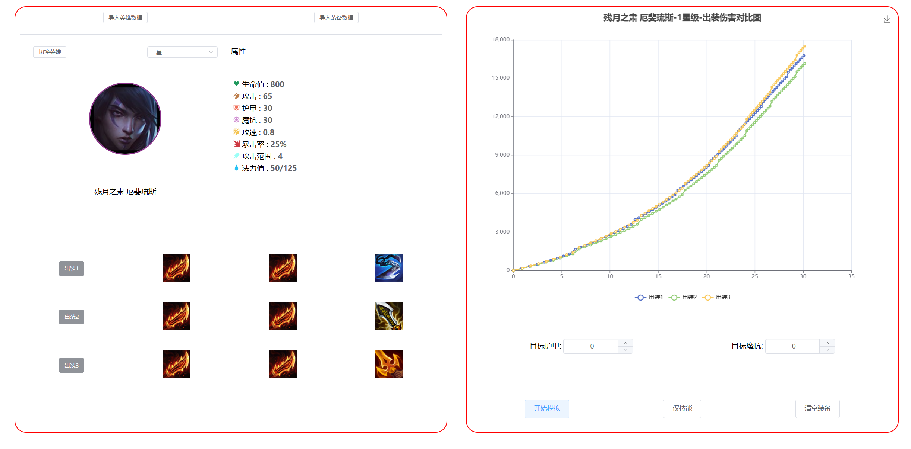
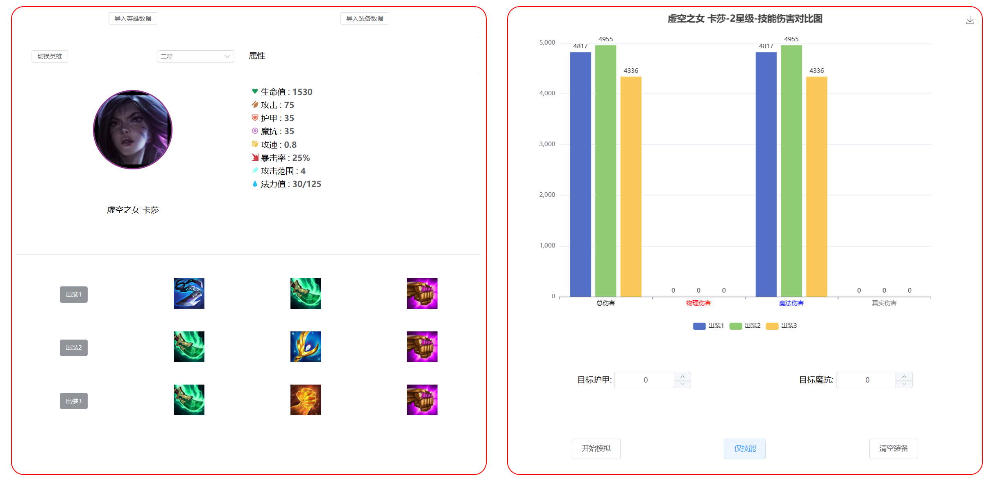
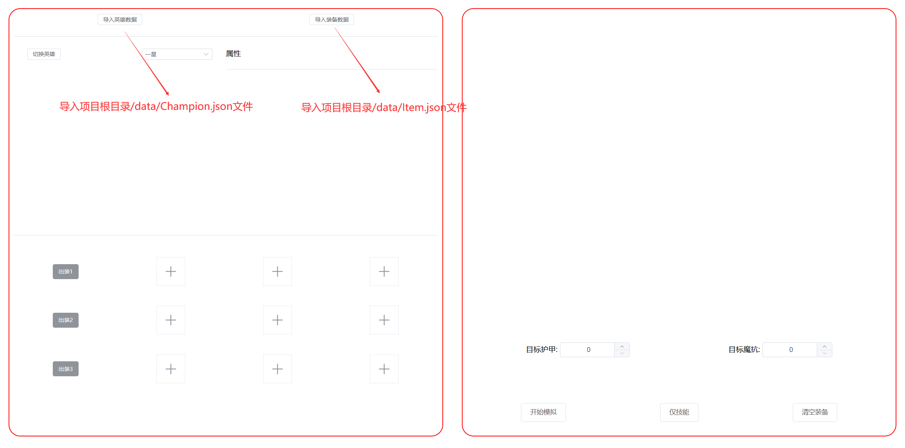

# 云顶之弈-出装计算器(Equipment Calculator for Teamfight Tactics)

* 各种装备实战**伤害模拟**计算 & 伤害曲线**可视化**
* 各种出装搭配**技能伤害**对比
* 部分持续伤害技能/特殊技能仅支持技能伤害计算
* 支持暴击属性 & 技能暴击 & 羊刀攻速叠加 & 鬼书日炎伤害 & 自定义护甲魔抗等
* 支持**WEB端** & Electron**桌面应用端**部署
* 无需后端/数据库

伤害模拟可视化



技能伤害可视化




# Usage
1.安装依赖

```bash
yarn install
```

2.网页端运行
```bash
yarn dev
```

3.打包部署为桌面端应用(打包成一个.exe可执行文件安装包)

```bash
yarn electron:build
```

4.Electron桌面端运行
```bash
yarn start
```

5.将项目根路径下的/data/s9.5中的Champion.json和Item.json导入到应用中,然后**选择英雄和装备**，点击**开始模拟**进行伤害模拟，**仅技能**进行技能伤害计算
> Champion.json:存放了所有英雄的信息(不定期进行更新)
> Item.json:存放了所有装备的信息
> 如果需要模拟其他赛季的英雄/装备，则需要导入其他赛季的英雄和装备数据(目前仅支持S9.5赛季)

